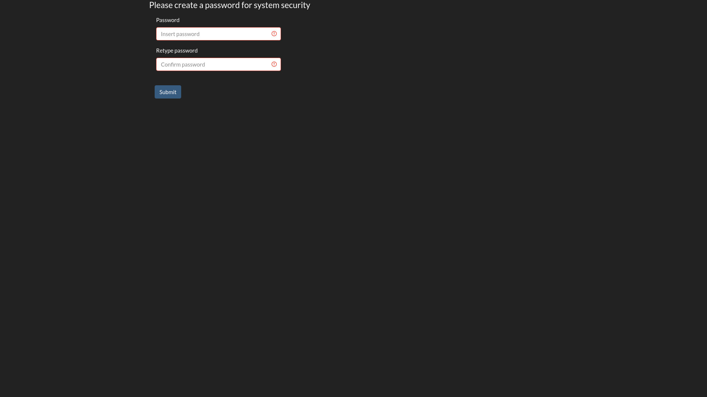
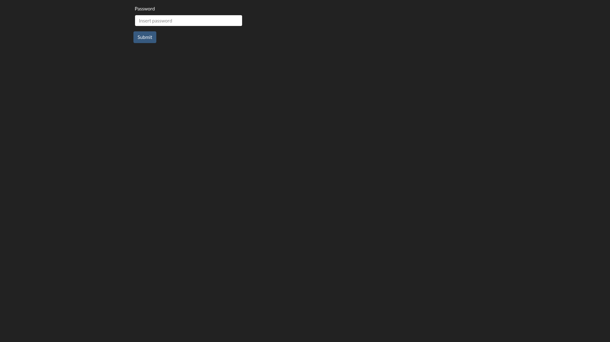
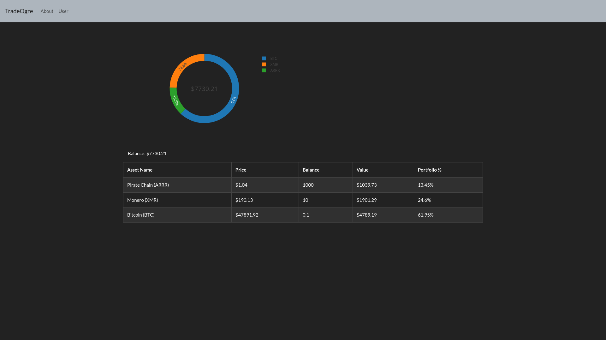

# TradeOgre explorer

This project is about a tradeogre wallet manager.\
It's just a demo.\
This project was bootstrapped with [Create React App](https://github.com/facebook/create-react-app).
It uses react-bootstrap

## Setup

- Insert your tradeogre holdings in a new file src/wallet.js (you can find an example in [src/wallet_example.js](src/wallet_example.js)).
- In the project directory, you can run:

### `yarn start`

Runs the app in the development mode.\
Open [http://localhost:3000](http://localhost:3000) to view it in the browser.

- Make up a password for login.
- See your holdings

Screen Shots

## TODO
- Get user wallet holding via tradeogre user api key
- Encrypt the user info with user password
- Do trading with wallet interface via tradeogre api

